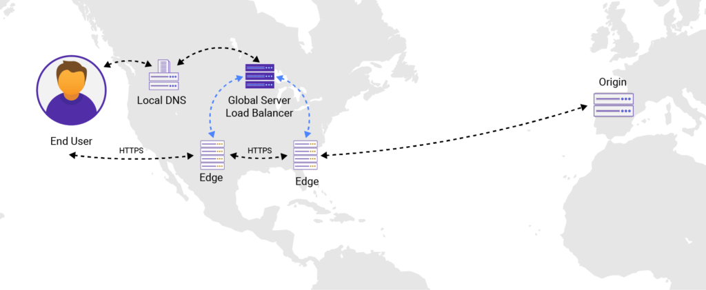
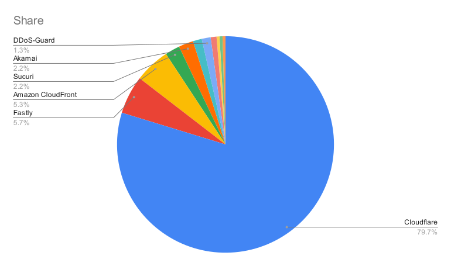
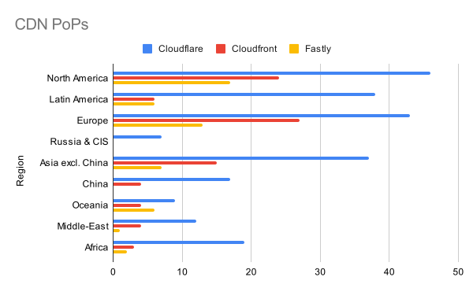

## 1. 概述

### 1.1. 定义简介

CDN（Content  Delivery  Network）内容分发网络，是构建在基础 IP 承载网络之上，具备内容自动化分布及流量集中化调度控制能力的叠加网络。

CDN 依靠部署在各地的边缘服务器（Edge Network），通过中心平台的负载均衡、内容分发、调度等功能模块，将内容发布到最接近用户的网络“边缘”，使用户就近获取所需内容，降低网络拥塞，提高用户访问网站的响应速度。 [^1]

### 1.2. 核心技术

CDN 改进了传统网络架构，广泛利用缓存技术，将各种缓存服务器分布到用户访问相对集中的基础网络中，并利用负载均衡技术将用户的访问指向离用户最近的最优的缓存服务器上，由缓存服务器直接响应用户的请求。支撑 CDN 运营的关键技术包括 CDN 负载均衡技术、内容分发技术以及内容缓存技术等。

#### 1.2.1. Anycast

Anycast（或称 IP Anycast），是一种允许多台机器共享同一个 IP 地址的网络技术。 根据用户请求的位置，路由器将其发送到网络中**距离最近**的机器。它可以**降低延迟**、**增加冗余**。如果某个数据中心下线，则 Anycast IP 会为用户选择最佳路径，并自动将他们重定向到下一个最近的数据中心。[^2]

#### 1.2.2. 内容分发

通常 CDN 支持标准 HTTP/1.1 或 HTTP/2.0 协议，支持分发标准的 [MIME 文件格式](https://developer.mozilla.org/en-US/docs/Web/HTTP/Basics_of_HTTP/MIME_types)，如 `text/html`、`application/json`。但是大部分传统 CDN 对于包含动态内容的协议，例如 WebSocket、gRPC、TCP、UDP 支持并不充分。

WebSocket 是一种实时通信协议，通过长期保持的 TCP  连接，在客户端（例如浏览器）和服务器之间提供双向通信。通过使用持久性开放连接，客户端和服务器可以相互发送实时数据，而客户端不必经常重新启动连接以检查要交换的新数据。WebSocket 连接通常用于聊天应用程序、协作平台、多人游戏和金融交易平台。[^3]

gRPC 协议是 Google 于 2015 年开发的，目的是使用较小的有效负载构建高效的 API，以减少带宽使用量，降低延迟并加快实施速度。[^4]

AWS 的 [Global Accelerator](https://docs.aws.amazon.com/global-accelerator/latest/dg/introduction-how-it-works.html) 与 Cloudflare 的 [Spectrum](https://www.cloudflare.com/zh-cn/products/cloudflare-spectrum/) 产品还支持 TCP/UDP 4 层流量代理。

值得一提的是，截至 2021 年 9 月，阿里云 CDN 的 Websocket 需要额外申请开通，并且[额外计费](https://help.aliyun.com/document_detail/145585.html)。华为云的 CDN [不支持 Websocket 协议](https://support.huaweicloud.com/cdn_faq/cdn_faq_0063.html)。

#### 1.2.3. 内容缓存

通常情况下，Web 缓存过程是在提供内容是由缓存保存静态文件（例如图像）的副本，以便下次能在更接近该用户的地方更快地提供。浏览器和[内容分发网络（CDN）](https://www.cloudflare.com/learning/cdn/what-is-a-cdn/)能在设定的时间段内缓存静态内容，并在继续收到对内容的请求时向用户提供。这是因为静态内容不会随着时间而变化；相同的文件可以反复提供给用户。

动态内容由更改页面内容的脚本生成。通过在 CDN 缓存中而不是在远程原始服务器中运行脚本，可以生成动态内容并从缓存中传递动态内容。因此，动态内容本质上被"缓存了" ，不必从源服务器提供，减少了对客户端请求的响应时间，并加快了动态网页的速度。[^5]

#### 1.2.4. DDoS 保护

配置得当的高级内容交付网络 (CDN) 有助于抵御 DDoS 攻击。在网站保护服务提供商使用其 CDN 专门加速使用 HTTP 和 HTTPS  协议的流量时，所有针对该 URL 发动的 DDoS 攻击流量都会在网络边缘被丢弃。这意味着第 3 层和第 4 层 DDoS  攻击会立即得到抵御，因为这种类型的流量并非以 Web 端口 80 和 443 为目标。该网络采用云端代理的形式，布设在客户的 IT  基础架构前方，将来自最终用户的流量传送到网站和应用程序。由于这些解决方案采用内嵌运作模式，面向 Web  的资产将会始终受到保护，不需要人工干预，也不会受到网络层 DDoS 攻击。

对于应用层防御，企业应考虑部署[Web 应用程序防火墙](https://www.akamai.com/zh/products/web-application-protector)，以对抗高级攻击，包括某些类型的 DDoS 攻击，比如旨在破坏 OSI 模型第 7 层应用程序处理的 HTTP GET 和 HTTP POST 泛洪攻击。[^6]

#### 1.2.5. Serverless FAAS

功能即服务 (FaaS) 是一种 的 [Serverless](https://www.cloudflare.com/learning/serverless/what-is-serverless/) 在边缘执行模块化代码 方式。FaaS 允许开发人员即时编写和更新一段代码，然后可以执行这些代码以响应事件，例如用户单击 Web 应用程序中的元素。[^7]

部分 CDN 厂商提供在 Edge Network 编写函数的方式实现灵活的连接、内容、缓存控制，通常函数支持 JavaScript 语言，一些产品也支持 Webassembly。

## 2. CDN 行业对比

根据 Akamai 的文章 “[什么是 CDN](https://www.akamai.com/zh/our-thinking/cdn/what-is-a-cdn)“ 所述 CDN 为性能、可用性、安全和智能提供了解决方案，本节将从这几方面进行对比。

### 2.1. 市场份额

#### 2.1.1. 全球静态资源 CDN 统计

根据 Datanyze 的[静态资源的 CDN 使用情况统计报告](https://www.datanyze.com/market-share/cdn--10)：

静态资源排名第一名的 Google Hosted Libraries 应该是 Google 静态资源例如 `fonts.google.com`，排名第五的 jsDelivr 是由 Cloudflare、Fastly 以及国内 CDN 厂商支持的开源静态资源 CDN。

Cloudflare 提供免费的 CDN，包含静态资源与动态资源加速，以及免费的 SSL 证书。

#### 2.1.2. 客户分析

按 CDN 提供的服务类型、目标最终用户以及所服务的地理区域进行细分。

许多使用 CDN 的公司需要多个 CDN 提供商，因为他们会有不同的需求，而单个 CDN 通常无法提供。

供应商可以选择在北美和欧洲设有分支机构的 CDN 提供商以满足其在这些地区的需求，同时在其他地方选择另一家本地供应商。随着小型企业的扩展，可用性和冗余成为首要考虑因素。多 CDN 策略使公司能够进行负载平衡，从而降低低效流量或中断的风险。

按客户数量计算的 Top CDN 提供商是 Cloudflare、Amazon Web Services (AWS)、Akamai、NetDNA、Fastly、Imperva、Verizon 和 Microsoft Azure。 [^8]

从表面上看，Cloudflare 似乎是其客户数量最大的 CDN。 Cloudflare 为超过 100 万客户提供 CDN 服务。 尽管它拥有庞大的客户群，但这个价值并不能说明全部。

Cloudflare 拥有不到 10,000 个中端市场和企业客户； 其大多数客户是中端市场和中小型企业。它的许多客户使用 Cloudflare 的服务来加速网站，同时也提高安全性。

#### 2.1.3. 市场分析

使用反向代理是网站的一个大趋势。在过去一年，使用反向代理的网站占全部网站的比例从 17.1% 增长到 21.6%。这个市场最大的提供商是 Cloudflare，市场份额占比约为 80%。另外两个提供商是 Fastly 和 AWS 的CloudFront。Cloudflare 的增长速度比这两家要低，所以市场份额跟一年前比有轻微缩小。但是整个反向代理市场在增大，CDN 行业都在高速增长。[^9]

根据 [w3techs](https://w3techs.com/technologies/history_overview/proxy/all) 2021 年 9 月的 CDN 厂商市场份额占比数据显示，Cloudflare 遥遥领先。

### 2.2. 性能

CDNPerf 提供的 2021 年 9 月 [CDN 性能对比排名 Top 10](https://www.cdnperf.com/)（仅供参考）：

CDN 性能取决于 PoP 接入点（Point of Presence）、ISP 网络质量（QoS）、高低峰、文件类型（静态/动态）、文件压缩技术（Gzip/Brotli）、HTTP 协议（HTTP/1.1, HTTP/2.0, HTTP/3）、Cache 机制（是否回源）、网络带宽等因素，不能一概而论。

#### 2.2.1. PoP 接入点

注：Akamai 没有公开 PoP 节点。

### 2.3. 可用性

RUM（Real User Monitoring）[Uptime 在线时间排名 Top 10](https://www.cdnperf.com/#!rum)：

### 2.4. 安全性

Cloudflare 的 DDoS 缓解方案得分高于 Akamai、亚马逊网络服务、谷歌和微软。 [^10]

*历史新闻事件：*
- [Cloudflare 阻止了 1720 万 rps 的 DDoS 攻击——有史以来最大的一次](https://blog.cloudflare.com/cloudflare-thwarts-17-2m-rps-ddos-attack-the-largest-ever-reported/)
- [Cloudflare 缓解了 2014 年有史以来最大的 DDoS 攻击](https://www.darkreading.com/attacks-breaches/ddos-attack-hits-400-gbit-s-breaks-record)

### 2.5. 功能

注：部分数据来自于 [Best CDN Comparison](https://cdncomparison.com/)。

### 2.6. 价格

注：价格成本计算数据来自 [CDNPerf Calculator](https://www.cdnperf.com/tools/cdn-calculator)。

[^1]: [2019 中国 CDN 行业市场研究报告](http://qccdata.qichacha.com/ReportData/PDF/8fc38073f5bddba3b5524da89ae69162.pdf)
[^2]: [How Anycast Works - An Introduction to Networking](https://www.keycdn.com/support/anycast)

[^3]: [Amazon CloudFront 发布针对 WebSocket 协议的支持](https://aws.amazon.com/cn/about-aws/whats-new/2018/11/amazon-cloudfront-announces-support-for-the-websocket-protocol/)
[^4]: [了解 Cloudflare gRPC 支持](https://support.cloudflare.com/hc/zh-cn/articles/360050483011-%E4%BA%86%E8%A7%A3-Cloudflare-gRPC-%E6%94%AF%E6%8C%81)
[^5]: [缓存静态和动态内容 | 它是如何工作的？](https://www.cloudflare.com/zh-cn/learning/cdn/caching-static-and-dynamic-content/)
[^6]: [什么是 DDoS 攻击？](https://www.akamai.com/zh/our-thinking/ddos)
[^7]: [What is Function-as-a-Service (FaaS)?](https://www.cloudflare.com/learning/serverless/glossary/function-as-a-service-faas/)
[^8]: [2020 State Of The CDN Industry: Trends, Size, And Market Share](https://blog.intricately.com/2020-state-of-the-cdn-industry-trends-market-share-customer-size)
[^9]: [Cloudflare垄断网站反向代理市场](https://xueqiu.com/1854210216/193203879)
[^10]: [Cloudflare Recognized As Industry Leader By Forrester And Gartner](https://getfishtank.ca/blog/cloudflare-recognized-as-industry-leader-by-forrester-and-gartner)
